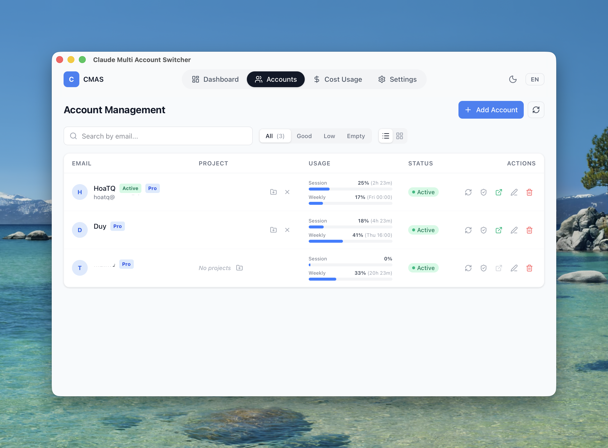
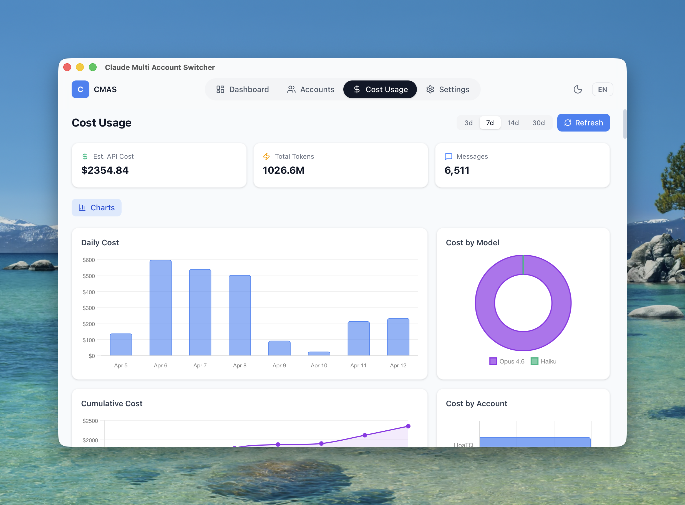

<p align="center">
  
</p>

<h1 align="center">CMAS — Claude Multi Account Switcher</h1>

<p align="center">
  Manage multiple Claude Code accounts from a single desktop app.<br/>
  Switch credentials instantly. Run isolated VSCode sessions per account. Track usage across all accounts.
</p>

<p align="center">
  <a href="https://github.com/boykioyb/CMAS/releases/latest">
    
  </a>
  <a href="https://creativecommons.org/licenses/by-nc-sa/4.0/">
    
  </a>
  
  
</p>

---

## Why CMAS?

Claude Code ties credentials to a single account per machine. If you have multiple Claude Pro/Max accounts (personal, work, client projects), you face a frustrating workflow:

- **Re-login every time** you switch accounts via `claude auth login`
- **Only one account active** — opening VSCode always uses the same global credential
- **No visibility** into which account is rate-limited or how much usage each account has consumed
- **Token expiry** requires manual re-authentication

CMAS solves all of this:

| Problem | CMAS Solution |
|---------|---------------|
| Constant re-login | One-click credential swap via OS keychain — zero re-login |
| Single active account | Isolated VSCode sessions per account running simultaneously |
| No usage visibility | Real-time usage tracking (session %, weekly %) across all accounts |
| Token expiry | Automatic token refresh using OAuth refresh tokens |
| Rate limit guessing | Visual status indicators + "switch to best account" suggestion |

---

## Screenshots

<p align="center">
  
  <br/><em>Account management — per-account usage bars, token health, project assignment</em>
</p>

<p align="center">
  
  <br/><em>Cost tracking — daily charts, per-model breakdown (Opus/Sonnet/Haiku), cumulative spending</em>
</p>

---

## Features

### Account Management
- **Add accounts** — Log in via Claude CLI OAuth, credentials saved to OS keychain
- **One-click switch** — Swap the active Claude Code credential instantly
- **Token auto-refresh** — Expired tokens are automatically refreshed using stored OAuth refresh tokens
- **Health checks** — Periodic token validation with auto-recovery (every 5 minutes)
- **Labels & plans** — Tag accounts (work/personal/client) and track Pro vs Free status

### Isolated VSCode Sessions
- **Per-account VSCode windows** — Each account opens in a fully isolated VSCode process
- **Run multiple accounts simultaneously** — Account A in one VSCode window, Account B in another
- **No credential conflicts** — Switching in CMAS does not affect already-open VSCode windows
- **Project assignment** — Assign project folders to accounts for one-click "switch + open"

### Usage Tracking
- **Real-time usage** — Session (5h) and weekly quota percentages from Claude API
- **Reset countdowns** — See exactly when session and weekly limits reset
- **Rate limit detection** — Visual indicators when an account hits its limit
- **Best account suggestion** — Recommends the account with the lowest current usage
- **Cost estimation** — Estimated API costs per model, daily charts, cumulative spending

### Other
- **Cross-platform** — macOS, Windows, and Linux
- **Multilingual** — English and Vietnamese
- **Configurable** — Custom Claude CLI path, config path, VSCode path
- **Auto-start** — Launch at login option

---

## Download

Download the latest release for your platform:

**[GitHub Releases](https://github.com/boykioyb/CMAS/releases/latest)**

| Platform | File |
|----------|------|
| macOS (Apple Silicon) | `CMAS_x.x.x_aarch64.dmg` |
| macOS (Intel) | `CMAS_x.x.x_x64.dmg` |
| Windows | `CMAS_x.x.x_x64-setup.exe` |
| Linux | `CMAS_x.x.x_amd64.deb` / `.AppImage` |

### Prerequisites

- **Claude CLI** installed and logged in to at least one account
  ```bash
  # Install Claude CLI (if not already installed)
  npm install -g @anthropic-ai/claude-code
  # Or via the official installer: https://docs.anthropic.com/en/docs/claude-code

  # Log in to your first account
  claude auth login
  ```

---

## Usage Guide

### 1. Add Your First Account

1. Make sure Claude CLI is logged in (`claude auth status` shows logged in)
2. Open CMAS and click **"+ Add Account"**
3. CMAS reads the current CLI credentials and saves them to the OS keychain
4. Optionally add a label (e.g., "Work", "Personal")

### 2. Add More Accounts

1. In a terminal, switch to another account:
   ```bash
   claude auth login
   ```
2. Complete the OAuth flow in your browser
3. Back in CMAS, click **"+ Add Account"** again
4. CMAS detects the new account and saves it separately

### 3. Switch Between Accounts

- **Global switch**: Click the switch icon on any account — this changes the active credential system-wide. Any new Claude Code session (terminal, VSCode) will use this account.
- **Best account**: CMAS suggests the account with the lowest usage — click to switch instantly.

### 4. Open Isolated VSCode Sessions

This is the killer feature. Each account can have its own VSCode window:

1. **Assign a project folder**: Click the folder icon on an account, select a project directory
2. **Open VSCode**: Click the VSCode icon — CMAS opens VSCode with:
   - The account's credentials loaded
   - The assigned project folder
   - A separate VSCode user-data directory (fully isolated process)
3. **Multiple simultaneous windows**: Open Account A's VSCode, then Account B's — both run independently
4. **No interference**: Switching accounts in CMAS does NOT affect already-open VSCode windows

```
┌─────────────────────────────────────────────────────┐
│  CMAS App                                           │
│  ┌────────────┐  ┌────────────┐  ┌────────────┐    │
│  │ Account A  │  │ Account B  │  │ Account C  │    │
│  │ Pro - 23%  │  │ Pro - 67%  │  │ Free - 0%  │    │
│  │ [VSCode]   │  │ [VSCode]   │  │ [Switch]   │    │
│  └─────┬──────┘  └─────┬──────┘  └────────────┘    │
│        │               │                            │
│        ▼               ▼                            │
│   ┌─────────┐    ┌─────────┐                        │
│   │ VSCode  │    │ VSCode  │   ← Independent        │
│   │ Window  │    │ Window  │     processes with      │
│   │ Proj A  │    │ Proj B  │     isolated creds      │
│   └─────────┘    └─────────┘                        │
└─────────────────────────────────────────────────────┘
```

### 5. Monitor Usage

- **Usage bars**: Each account shows session (5h) and weekly usage percentages
- **Sync button**: Click to refresh usage data from the Claude API
- **Auto-refresh**: Usage auto-refreshes every 5 minutes (configurable in Settings)
- **Cost tab**: View estimated API costs with daily charts and per-model breakdown

### 6. Token Health & Auto-Refresh

CMAS automatically manages token lifecycle:

- **On startup**: Syncs credentials and checks all token health
- **Every 5 minutes**: Background health check + auto-refresh for expired tokens
- **Manual check**: Click the shield icon on any account to check and refresh
- **OAuth refresh**: Uses the stored refresh token to get new access tokens — no re-login needed

If auto-refresh fails (e.g., refresh token revoked), the account status changes to "Expired" and you need to re-login via CLI.

---

## How It Works

### Credential Management

CMAS stores each account's OAuth credentials in the OS keychain (macOS Keychain / Windows Credential Manager / Linux Secret Service):

1. **Active slot** — The credential Claude Code CLI/extension reads (`Claude Code-credentials` service)
2. **Per-account backup** — Each account has its own backup (`CMAS-Account-{id}` service)
3. **Switching** = backup current → restore target → update `~/.claude.json`

### VSCode Isolation (3 layers)

1. **`--user-data-dir`** — Separate Electron process per account (independent extensions, settings)
2. **`HOME` override** — Per-session home directory with isolated `.claude.json`
3. **Keychain entry** — Credentials written to a per-session keychain slot

### Token Auto-Refresh

```
Token lifecycle:
  Access token expires (every ~8 hours)
  → CMAS detects via expiresAt field or API health check
  → Calls OAuth refresh endpoint with stored refresh token
  → Updates backup + active keychain with new tokens
  → Account status stays "OK" — no user action needed
```

---

## Tech Stack

| Layer | Technology |
|-------|------------|
| Frontend | Vue 3, TypeScript, Tailwind CSS 4, Pinia, Vue Router, vue-i18n |
| Backend | Rust, Tauri 2 |
| Credential | macOS `security` CLI / Windows Credential Manager / Linux Secret Service |
| Storage | JSON files in `~/.claude-switcher/` |
| API | Claude OAuth API (usage, roles, token refresh) |

---

## Development

### Requirements

- [Node.js](https://nodejs.org/) >= 18
- [Rust](https://rustup.rs/) >= 1.77.2
- [Tauri CLI](https://v2.tauri.app/start/prerequisites/)
- Platform-specific dependencies (see [Tauri prerequisites](https://v2.tauri.app/start/prerequisites/))

### Setup

```bash
git clone https://github.com/boykioyb/CMAS.git
cd CMAS
npm install
```

### Run in Development

```bash
npx tauri dev
```

### Build for Production

```bash
npx tauri build
```

---

## Project Structure

```
CMAS/
├── src/                          # Frontend (Vue 3 + TypeScript)
│   ├── components/
│   │   ├── accounts/             # AccountGrid, AccountTable, Add/Edit dialogs
│   │   ├── common/               # Navbar, Toast, Dialog, ProgressBar
│   │   └── dashboard/            # CurrentAccount, StatsCards, BestAccountSuggestion
│   ├── pages/                    # Dashboard, Accounts, Cost Usage, Settings
│   ├── stores/                   # Pinia stores (account, config, ui, costUsage)
│   ├── i18n/                     # English, Vietnamese translations
│   └── types/                    # TypeScript interfaces
├── src-tauri/                    # Backend (Rust + Tauri 2)
│   ├── src/
│   │   ├── commands/             # Tauri IPC commands
│   │   ├── models/               # Data models (Account, Config, Usage)
│   │   └── services/
│   │       ├── keychain.rs       # OS keychain read/write (macOS/Windows/Linux)
│   │       ├── token_refresh.rs  # OAuth token refresh
│   │       ├── vscode.rs         # VSCode session isolation
│   │       ├── usage_tracker.rs  # Parse JSONL, calculate usage
│   │       ├── claude_auth.rs    # Claude CLI integration
│   │       └── claude_config.rs  # Claude config management
│   └── capabilities/             # Tauri permission config
└── docs/                         # Screenshots & documentation
```

---

## Contributing

See [CONTRIBUTING.md](CONTRIBUTING.md) for guidelines.

## License

[CC BY-NC-SA 4.0](https://creativecommons.org/licenses/by-nc-sa/4.0/) — see [LICENSE](LICENSE).

### Trademark

"CMAS" and "Claude Multi Account Switcher" are trademarks of Hoa TQ. See [TRADEMARK.md](TRADEMARK.md).

## Author

**Hoa TQ** — [GitHub](https://github.com/boykioyb) · [hoatq.dev](https://hoatq.dev)
